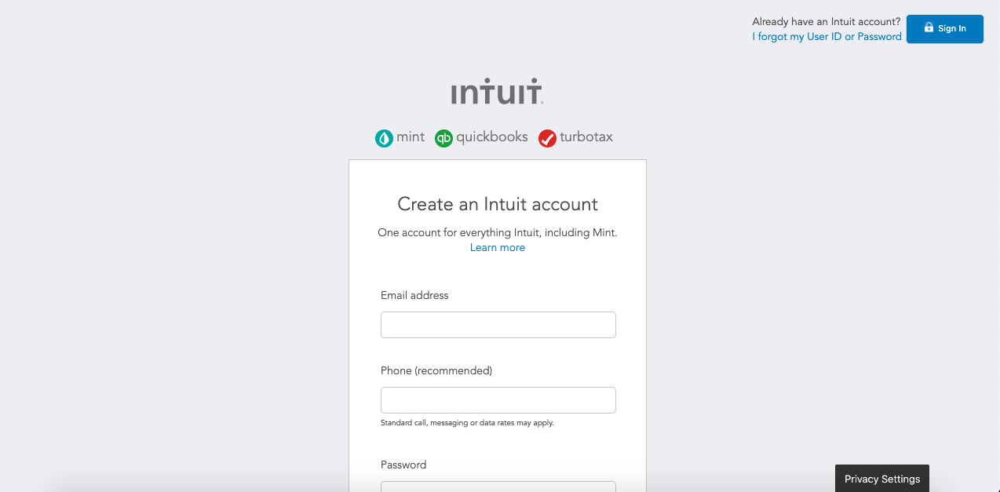

# Project: HTML FORMS
This is a SignUp form cloned using HTML and CSS.

This is a form used by Mint.com for signing up new users cloned using HTML and CSS. It has as main sections, the navigation bar, the company logo, a form section with input elements of different types and a footer.
The aim is to test our skills in displaying and inputing data.

# Built with
<ul>
<li>HTML</li>
<li>CSS</li>
</ul>

# Authors
<ul>
<li>GitHub: @georjane</li>
<li>GitHub: @ahmadchata</li>
</ul>

# Show your support
Give a star if you like this project

# Acknowlegdements
<ul>
<li>Hat tip to Youtube</li>
<li>The Odin Project</li>
</ul>